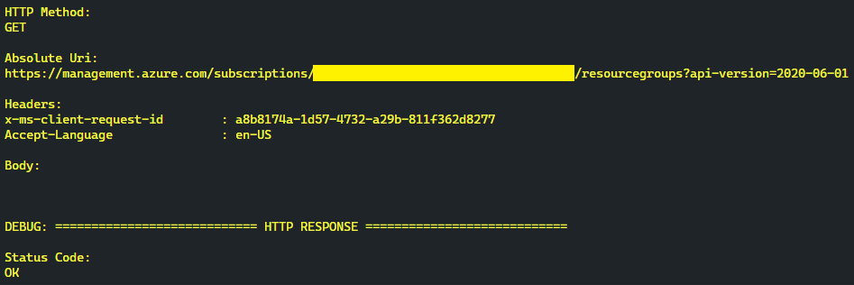
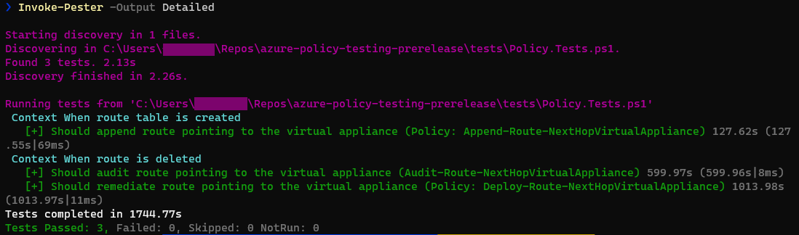
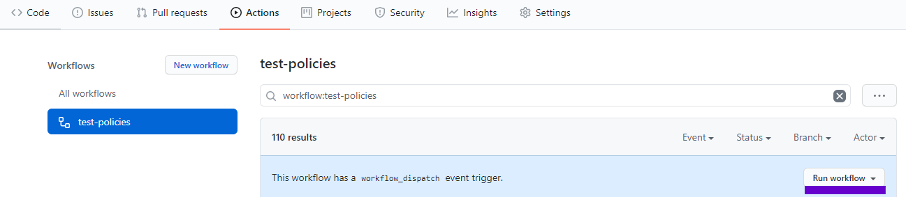
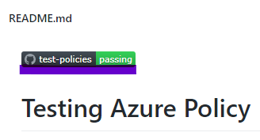

# Testing Azure Policy

## Introduction
This repository outlines an automated testing approach for Azure Policies. The approach is fundamentally based on behavior-driven development (BDD) to improve communication between developers, security experts and compliance officers. The PowerShell testing framework Pester, Azure PowerShell and GitHub Actions are used in conjunction to automate the tests and run them as part of a DevOps pipeline. After the problem statement, the solution is described in more detail including how to set it up in your Azure environment.

## Problem Statement
Let's start simple: Why should you test Azure Policy in the first place? It's just configuration not code. This is a fair statement, but any configuration changes on Azure Policies can be highly impactful and when done wrong even lead to production outages. Just see this example for an Azure Policy, which is quiet common for enterprise customers adopting Azure (See: [Hub-spoke network topology in Azure](https://docs.microsoft.com/en-us/azure/architecture/reference-architectures/hybrid-networking/hub-spoke)). In a nutshell, whenever a route table is created, a user-defined route (UDR) should be added to route all internet traffic to a virtual appliance hosted centrally in the hub virtual network for outbound traffic inspection:

```json
{
    "mode": "All",
    "parameters": {
        "routeTableSettings": {
            "type": "Object",
            "metadata": {
                "displayName": "Route Table Settings",
                "description": "Location-specific settings for route tables."
            }
        }
    },
    "policyRule": {
        "if": {
            "allOf": [
                {
                    "field": "type",
                    "equals": "Microsoft.Network/routeTables"
                },
                {
                    "count": {
                        "field": "Microsoft.Network/routeTables/routes[*]",
                        "where": {
                            "allOf": [
                                {
                                    "field": "Microsoft.Network/routeTables/routes[*].addressPrefix",
                                    "equals": "0.0.0.0/0"
                                },
                                {
                                    "field": "Microsoft.Network/routeTables/routes[*].nextHopType",
                                    "equals": "VirtualAppliance"
                                },
                                {
                                    "field": "Microsoft.Network/routeTables/routes[*].nextHopIpAddress",
                                    "equals": "[parameters('routeTableSettings')[field('location')].virtualApplianceIpAddress]"
                                }
                            ]
                        }
                    },
                    "equals": 0
                }
            ]
        },
        "then": {
            "effect": "append",
            "details": [
                {
                    "field": "Microsoft.Network/routeTables/routes[*]",
                    "value": {
                        "name": "internet",
                        "properties": {
                            "addressPrefix": "0.0.0.0/0",
                            "nextHopType": "VirtualAppliance",
                            "nextHopIpAddress": "[parameters('routeTableSettings')[field('location')].virtualApplianceIpAddress]"
                        }
                    }
                }
            ]
        }
    }
}
```
Now just imagine, we configured the wrong IP addresses for our virtual appliance or we forgot to add this route at all. Depending on the scope of the policy assignment, a lot of applications might stop working. So we should test it, since any change might have an high impact on production environments.

## Solution

### Test Pyramid
So how can we test Azure Policy? Which kind of tests should we perform? Martin Fowler listed these test categories in his definition of a [test pyramid](https://martinfowler.com/bliki/TestPyramid.html):


**UI tests** typically are recording the interaction of the user with the user interface. When it comes to testing Azure Policy, a lot of people heavily rely on UI Tests using the Azure Portal. Basically, clicking through the Azure Portal and document each step. While this seems fine to get started with testing policies, its also very slow since a human being has to click through the portal and document each step. Since multiple policies can be assigned to the same scope or inherited from parent scopes (Management Group, Subscription and Resource Group), introducing a new policy can lead to regression bugs when overlapping with other existing policies. Just think of an example with two policies overlapping and both of them allowing different Azure regions for deployment - no deployment at all will be possible. Basically, this requires a lot of additional regression testing and further slows down the testing process. So, what about these handy tools for UI automation testing? Both automated and manual UI tests will be hard to maintain, since Azure is rapidly evolving and so does the Azure Portal. Additionally, browser caching issues might lead to false positives during UI testing. To cut a long story short, it is not possible to use manual or automated UI tests to validate Azure Policy in an effective and scalable manner, they are time consuming to run and hard to maintain.

**Service tests** or **API tests** are actual code targeting the API layer. In the context of Azure Policy, you could actually call the [Azure REST API](https://docs.microsoft.com/en-us/rest/api/azure/) to perform tests, which is a much more stable and a versioned contract to test against than the UI. Also, regression testing can be done way easier by just running all the test scripts either manually triggered or even better by performing [continuous integration](https://martinfowler.com/articles/continuousIntegration.html) within your DevOps pipeline of choice, i.e. [GitHub Actions](https://github.com/features/actions). Finally, since the tests are written as code, parallelization techniques can be applied to speed up the tests. Taking into consideration that performing compliance scans and remediation with Azure Policy can take a few minutes per test, parallelization helps to scale the test suite to potentially hundreds of tests. Going forward, we will prefer the term *API tests* instead of *service tests* since much more applicable when testing policies.

**Unit tests** are the fastest and cheapest way to gain feedback to verify that a single unit of code, e.g. a class or a method, are actually working as expected. Typically, unit tests are focused on testing business logic. Unfortunately, they also require to have the code under test available. This does not apply to Azure Policy, since the policy engine itself is not available to the public. If this ever changes, most of your test suite should become unit tests as indicated by the different sizes for the surface areas in the test pyramid. Additionally, service tests might be used to validate policy remediation, which cannot be done with unit tests. Finally, if UI tests are used at all, they might be just limited to smoke testing.

In summary, **UI tests** are not suitable for testing Azure Policy at scale and **Unit tests** are not doable without the policy engine being available to the public. Hence, we will focus on testing Azure Policy with **API tests** going forward.

### API Tests
For our API Tests, we will use **Azure PowerShell** to call the Azure REST API. Hence the question, why are we not calling the API directly? 

First, Azure PowerShell handles a lot of low-level details which you would be exposed to when directly calling the API. For instance, for long-running operations, the HTTP status code 202 (Accepted) and an URL for the status update to determine when the operation is completed is returned. This basically means that you have to perform [busy waiting](https://en.wikipedia.org/wiki/Busy_waiting) and periodically call the URL for the status update to wait for the operations to complete. Later is important for policy remediation and compliance scans, which can take a few minutes to complete. All this is already handled for you in Azure PowerShell (See: [LongRunningOperationHelper.cs](https://github.com/Azure/azure-powershell/blob/1bcbe7b1f7a3323ac98f7754ba03eeb6b45e79f2/src/Resources/ResourceManager/Components/LongRunningOperationHelper.cs#L139)). Just see this sample code written in Azure PowerShell, which is easy to understand even without a lot of explanations:

```powershell
# Create route table
$routeTableName = "route-table"
New-AzRouteTable `
    -Name $routeTableName `
    -ResourceGroupName $ResourceGroup.ResourceGroupName `
    -Location $ResourceGroup.Location
            
# Verify that route pointing to the virtual appliance was appended by policy
Get-AzRouteTable -ResourceGroupName $ResourceGroup.ResourceGroupName -Name $routeTableName
| Test-RouteNextHopVirtualAppliance
| Should -BeTrue
```

Second, Azure PowerShell also allows you to fallback and conveniently directly call the Azure REST API when needed (Side note: Azure Policy only applies to PUT and PATCH requests, so DELETE requests are not captured):

```powershell
# Remove-AzRouteConfig will issue a PUT request for routeTables and hence the route will be appended by policy.
# In order to remove the route, directly call the REST API by issuing a DELETE request for route.
$httpResponse = Invoke-AzRestMethod `
    -ResourceGroupName $RouteTable.ResourceGroupName `
    -ResourceProviderName "Microsoft.Network" `
    -ResourceType @("routeTables", "routes") `
    -Name @($RouteTable.Name, $route.Name) `
    -ApiVersion "2020-05-01" `
    -Method "DELETE"

# When HTTP request is not successful
if (-not ($httpResponse.StatusCode -in 200..299)) {
    throw "Route '$($route.Name)' could not be removed from route table '$($RouteTable.Name)'."
}
```
Additionally, you can view any underlying HTTP request initiated by Azure PowerShell and the corresponding HTTP response even when using the high-level methods using the ```-Debug``` flag:

```powershell
Get-AzResourceGroup -Debug
```


Third, Azure Policy is well supported and documented in Azure PowerShell. Just see this more complex example to trigger a long-running policy remediation including an upfront compliance scan for a policy with [DeployIfNotExist](https://docs.microsoft.com/en-us/azure/governance/policy/concepts/effects#deployifnotexists) effect:

```powershell
$job = Start-AzPolicyRemediation `
    -ResourceGroupName $ResourceGroup.ResourceGroupName `
    -PolicyAssignmentId $policyAssignmentId `
    -Name $ResourceGroup.ResourceGroupName `
    -ResourceDiscoveryMode ReEvaluateCompliance `
    -LocationFilter $ResourceGroup.Location `
    -AsJob
$remediation = $job | Wait-Job | Receive-Job
    
# If remediation is not successful
if ($remediation.ProvisioningState -ne "Succeeded") {
    throw "Policy '$($PolicyName)' could not remediate resource group '$($ResourceGroup.ResourceGroupName)'."
}
```

When using Azure PowerShell or PowerShell in general, you can also make use of its powerful test framework [Pester](https://pester.dev/docs/quick-start). Pester is based on [Behavior-driven Development](https://en.wikipedia.org/wiki/Behavior-driven_development) (BDD), a software development approach that has evolved from [Test-driven Development](https://en.wikipedia.org/wiki/Test-driven_development) (TDD). It differs by being written in a shared [Domain-specific Language](https://en.wikipedia.org/wiki/Domain-specific_language) (DSL), which improves communication between tech and non-tech teams and stakeholders, i.e. developers creating Azure Policies and compliance officers and security experts defining their requirements. In both development approaches, tests are written ahead of the code, but in BDD, tests are more user-focused and based on the system’s behavior (See: [Powershell BDD with Pester](https://www.netscylla.com/blog/2019/04/28/Powershell-BDD-with-Pester.html)). In the context of Azure Policy, a test written in Pester might look like this:

```powershell
Context "When route table is created" -Tag route-table-create {
    It "Should append route pointing to the virtual appliance (Policy: Append-Route-NextHopVirtualAppliance)" {
        # Create route table
        routeTableName = "route-table"
        New-AzRouteTable `
            -Name $routeTableName `
            -ResourceGroupName $ResourceGroup.ResourceGroupName `
            -Location $ResourceGroup.Location

        # Verify that route pointing to the virtual appliance was appended by policy
        Get-AzRouteTable -ResourceGroupName $ResourceGroup.ResourceGroupName -Name $routeTableName
        | Test-RouteNextHopVirtualAppliance
        | Should -BeTrue
    }
}
```

Also, the test results are very easy to grasp, by just looking at the detailed output of [Invoke-Pester](https://github.com/pester/Pester#simple-and-advanced-interface):


Finally, Pester tests can also run during [continuous integration](https://martinfowler.com/articles/continuousIntegration.html) as part of your DevOps pipeline. Following an example using [GitHub Actions](https://github.com/features/actions) (See: [test-policies.yml](./.github/workflows/test-policies.yml))::

```yaml
- name: Test Azure Policies
  shell: pwsh
  run: |
     Invoke-Pester -Output Detailed -CI
```

As you can see, we can combine Pester and Azure PowerShell to conveniently test Azure Policy. But how does this look in more detail? How to test the different [Azure Policy effects](https://docs.microsoft.com/en-us/azure/governance/policy/concepts/effects)? Let's put them into buckets to ease the conversation:
- **Synchronously** evaluated
- **Asynchronously** evaluated
- **Asynchronously** evaluated with **remediation task** support

Policy effects, which are **synchronously** evaluated are *Append*, *Deny* and *Modify* ((See: [Append-Route-NextHopVirtualAppliance](./policies/Append-Route-NextHopVirtualAppliance/policy.json))). Basically, the policies already take effect during the PATCH/PUT request. Testing them with Azure PowerShell is quiet straightforward and basically just performing a PATCH/PUT request like creating a route table (See: [Policy.Tests.ps1](./tests/Policy.Tests.ps1)):

```powershell
Context "When route table is created" -Tag route-table-create {
    It "Should append route pointing to the virtual appliance (Policy: Append-Route-NextHopVirtualAppliance)" {
        # Create route table
        $routeTableName = "route-table"
        New-AzRouteTable `
        -Name $routeTableName `
        -ResourceGroupName $ResourceGroup.ResourceGroupName `
        -Location $ResourceGroup.Location
            
        # Verify that route pointing to the virtual appliance was appended by policy
        Get-AzRouteTable -ResourceGroupName $ResourceGroup.ResourceGroupName -Name $routeTableName
        | Test-RouteNextHopVirtualAppliance
        | Should -BeTrue
    }
}
```

For reusability reason, the utility methods like ```Test-RouteNextHopVirtualAppliance``` were moved into a dedicated PowerShell Module (See: [Policy.Utils.psm1](./tests/Policy.Utils.psm1)):

```powershell
function Test-RouteNextHopVirtualAppliance {
    param (
        [Parameter(Mandatory = $true, ValueFromPipeline = $true)]
        [ValidateNotNull()]
        [Microsoft.Azure.Commands.Network.Models.PSRouteTable]$RouteTable
    )
    
    $route = $RouteTable | Get-RouteNextHopVirtualAppliance 

    return $null -ne $route
}

function Get-RouteNextHopVirtualAppliance {
    param (
        [Parameter(Mandatory = $true, ValueFromPipeline = $true)]
        [ValidateNotNull()]
        [Microsoft.Azure.Commands.Network.Models.PSRouteTable]$RouteTable
    )
    
    $addressPrefix = "0.0.0.0/0"
    $nextHopType = "VirtualAppliance"
    $nextHopIpAddress > $null
    switch ($RouteTable.Location) {
        "northeurope" { $nextHopIpAddress = "10.0.0.23"; break }
        "westeurope" { $nextHopIpAddress = "10.1.0.23"; break }
        default { throw "Location '$($RouteTable.Location)' not handled." }
    }

    $route = $RouteTable.Routes | Where-Object { 
        ($_.AddressPrefix -eq $addressPrefix) -and
        ($_.NextHopType -eq $nextHopType) -and
        ($_.NextHopIpAddress -eq $nextHopIpAddress)
    } | Select-Object -First 1 # Address prefixes are unique within a route table

    return $route
}
```

**Asynchronously** evaluated policy effects are *Audit* and *AuditIfNotExists*. The PATCH/PUT request just triggers a compliance scan, but the evaluation happens asynchronously in the background, e.g. [Audit-Route-NextHopVirtualAppliance](./policies/Audit-Route-NextHopVirtualAppliance/policy.json). As it turns out, we can manually trigger a compliance scan and wait for its completion by using Azure PowerShell (See: [Policy.Tests.ps1](./tests/Policy.Tests.ps1) and [Policy.Utils.psm1](./tests/Policy.Utils.psm1)):

```powershell
Context "When route is deleted" -Tag route-delete {
    It "Should audit route pointing to the virtual appliance (Audit-Route-NextHopVirtualAppliance)" {
        # Create route table and remove route pointing to the virtual appliance, which was appended by policy
        $routeTableName = "route-table"
        $routeTable = New-AzRouteTable `
            -Name $routeTableName `
            -ResourceGroupName $ResourceGroup.ResourceGroupName `
            -Location $ResourceGroup.Location
        | Remove-RouteNextHopVirtualAppliance

        # Trigger compliance scan for resource group and wait for completion
        $ResourceGroup | Complete-PolicyComplianceScan 

        # Verify that route table is incompliant
        $routeTable 
        | Get-PolicyComplianceState -PolicyName "Audit-Route-NextHopVirtualAppliance"
        | Should -BeFalse
    }
}

function Complete-PolicyComplianceScan {
    param (
        [Parameter(Mandatory = $true, ValueFromPipeline = $true)]
        [ValidateNotNull()]
        [Microsoft.Azure.Commands.ResourceManager.Cmdlets.SdkModels.PSResourceGroup]$ResourceGroup
    )

    $job = Start-AzPolicyComplianceScan -ResourceGroupName $ResourceGroup.ResourceGroupName -AsJob 
    $job | Wait-Job
}

function Get-PolicyComplianceState {
    param (
        [Parameter(Mandatory = $true, ValueFromPipeline = $true)]
        [ValidateNotNull()]
        [Microsoft.Azure.Commands.Network.Models.PSResourceId]$Resource,
        [Parameter(Mandatory = $true)]
        [ValidateNotNullOrEmpty()]
        [string]$PolicyName
    )

    $policyDefinition = Get-AzPolicyDefinition | Where-Object { $_.Properties.DisplayName -eq $PolicyName }
    
    if ($null -eq $policyDefinition) {
        $scope = "/subscriptions/$((Get-AzContext).Subscription.Id)"
        throw "Policy definition '$($PolicyName)' was not found at scope '$($scope)'."
    }

    $compliant = (
        Get-AzPolicyState -PolicyDefinitionName $policyDefinition.Name 
        | Where-Object { $_.ResourceId -eq $Resource.Id } 
        | Select-Object -Property ComplianceState
    ).ComplianceState -eq "Compliant"

    return $compliant
}
```

Last but not least, the **asynchronously** evaluated policy effects with **remediation task** support are *DeployIfNotExists* and *Modify*. Same as the asynchronously evaluated policies, the compliance scan happens in the background. Additionally, non-compliant resources can be remediated with a remediation task. When testing these kind of policy effects, the easiest way is to just start a remediation task including an upfront compliance scan (See: [Policy.Tests.ps1](./tests/Policy.Tests.ps1) and [Policy.Utils.psm1](./tests/Policy.Utils.psm1)):

```powershell
Context "When route is deleted" -Tag route-delete {
    It "Should remediate route pointing to the virtual appliance (Policy: Deploy-Route-NextHopVirtualAppliance)" {
        # Create route table and remove route pointing to the virtual appliance, which was appended by policy
        $routeTableName = "route-table"
        New-AzRouteTable `
            -Name $routeTableName `
            -ResourceGroupName $ResourceGroup.ResourceGroupName `
            -Location $ResourceGroup.Location
        | Remove-RouteNextHopVirtualAppliance

        # Remediate resource group and wait for completion
        $ResourceGroup | Complete-PolicyRemediation -PolicyName "Deploy-Route-NextHopVirtualAppliance"

        # Verify that removed route pointing to the virtual appliance was remediated by policy
        Get-AzRouteTable -ResourceGroupName $ResourceGroup.ResourceGroupName -Name $routeTableName
        | Test-RouteNextHopVirtualAppliance
        | Should -BeTrue
    }
}

function Complete-PolicyRemediation {
    param (
        [Parameter(Mandatory = $true, ValueFromPipeline = $true)]
        [ValidateNotNull()]
        [Microsoft.Azure.Commands.ResourceManager.Cmdlets.SdkModels.PSResourceGroup]$ResourceGroup,
        [Parameter(Mandatory = $true)]
        [ValidateNotNullOrEmpty()]
        [string]$PolicyName
    )
    
    $scope = "/subscriptions/$((Get-AzContext).Subscription.Id)"
    $policyAssignmentId = (Get-AzPolicyAssignment -Scope $scope
        | Select-Object -Property PolicyAssignmentId -ExpandProperty Properties 
        | Where-Object { $_.DisplayName -eq $PolicyName } 
        | Select-Object -Property PolicyAssignmentId -First 1
    ).PolicyAssignmentId
    
    if ($null -eq $policyAssignmentId) {
        throw "Policy assignment was not found for policy '$($PolicyName)' at scope '$($scope)'."
    }

    $job = Start-AzPolicyRemediation `
        -ResourceGroupName $ResourceGroup.ResourceGroupName `
        -PolicyAssignmentId $policyAssignmentId `
        -Name $ResourceGroup.ResourceGroupName `
        -ResourceDiscoveryMode ReEvaluateCompliance `
        -LocationFilter $ResourceGroup.Location `
        -AsJob
    $remediation = $job | Wait-Job | Receive-Job
    
    # When remediation is not successful
    if ($remediation.ProvisioningState -ne "Succeeded") {
        throw "Policy '$($PolicyName)' could not remediate resource group '$($ResourceGroup.ResourceGroupName)'."
    }
}
```

As you can see, the combination of Pester, Azure PowerShell and GitHub Actions is quiet powerful and convenient for testing Azure Policy. In the next chapter, we will describe how to setup this repository with your GitHub account using your Azure environment, so you can further explore it.

## Setup
### Folder Structure
Before going into the steps to setup this repository with your GitHub account using your Azure environment, it is important to understand how the folders in this repository are structured (generated by using the [tree](http://mama.indstate.edu/users/ice/tree/) command):

```bash
.
├── .github
│   └── workflows
│       ├── psmodules.json
│       └── test-policies.yml
├── LICENSE
├── README.md
├── docs
│   ├── azure-powershell-debug.png
│   ├── pester-test-results.png
│   └── test-pyramid.png
├── policies
│   ├── Append-Route-NextHopVirtualAppliance
│   │   ├── assign.test.json
│   │   └── policy.json
│   ├── Audit-Route-NextHopVirtualAppliance
│   │   ├── assign.test.json
│   │   └── policy.json
│   └── Deploy-Route-NextHopVirtualAppliance
│       ├── assign.test.json
│       └── policy.json
└── tests
    ├── Policy.Tests.ps1
    └── Policy.Utils.psm1
```

- **.github/workflows**: Contains the GitHub workflow used to create the policy definitions, assign them to your subscription and run the tests. The GitHub action *[azure/manage-azure-policy@v0](https://github.com/marketplace/actions/manage-azure-policy)* is still pre-release and does not yet support management groups. Also, it has an has an issue related policies with remediation task support (See: [GitHub Issue #23](https://github.com/Azure/manage-azure-policy/issues/23)). This issue is mitigated by a workaround in the GitHub workflow (See: [Fix Azure Policy Assignment](./.github/workflows/test-policies.yml)).
- **docs**: Contains any additional Markdown files and images used for documentation purposes, except the **README.md** at the root, which serves as the entry point.
- **policies**: All the policy definitions and assignments are placed here. The GitHub workflow replaces the token ```#{AZURE_SUBSCRIPTION_ID}#``` with a GitHub secret called ```AZURE_SUBSCRIPTION_ID``` to ease the setup in your Azure environment. Initially, the policies were exported via the Azure Portal using the new [Export definitions](https://docs.microsoft.com/en-us/azure/governance/policy/how-to/export-resources) feature, but new policies can also be created manually and placed in here.
- **tests**: This is were all the magic happens. The tests itself are defined in [Policy.Tests.ps1](./tests/Policy.Tests.ps1),which imports the PowerShell module [Policy.Utils.psm1](./tests/Policy.Utils.psm1) containing the utility or helper methods.

### Step Guide
1. **Prerequisite:** You should have installed Azure CLI on your local machine to run the command or use the Azure CloudShell in the Azure portal. To install Azure CLI, follow [Install Azure CLI](https://docs.microsoft.com/en-us/cli/azure/install-azure-cli?view=azure-cli-latest). To use Azure CloudShell, follow [Quickstart for Bash in Azure Cloud Shell](https://docs.microsoft.com/en-us/azure/cloud-shell/quickstart).
2. **Prerequisite:** Verify that [jq](https://stedolan.github.io/jq/) is installed on your system by running ```jq --version```. It should already come pre-installed in Azure CloudShell. If you run the Azure CLI commands locally you might have to install it, e.g. Ubuntu:

    ```bash
    sudo apt-get install jq
    ```

3. Fork this repository (See: [Fork a repo](https://docs.github.com/en/free-pro-team@latest/github/getting-started-with-github/fork-a-repo))


4. Create a [GitHub Secret](https://www.edwardthomson.com/blog/github_actions_11_secrets.html) named ```AZURE_SUBSCRIPTION_ID``` with the value being your Azure Subscription ID. You can retrieve the ID using the Azure CLI:

    ```bash
    az account show | jq -r '.id'
    ```
5. Create a [GitHub Secret](https://www.edwardthomson.com/blog/github_actions_11_secrets.html) named ```AZURE_CREDENTIALS``` with the value being the JSON object outputted by this Azure CLI command:
    
    ```bash
    az ad sp create-for-rbac --name "azure-policy-testing" --role "Owner"  \
    --scopes /subscriptions/{YOUR AZURE SUBSCRIPTION ID} \
    --sdk-auth
    ```
    
3. Change the ```README.md``` to represent your build status:
    
    ```markdown
    
    ```
    
4. Manually run the ```test-policies``` GitHub workflow and wait for it to complete successfully: 



5. Alternatively, you can perform a code change on either the GitHub workflow, the policies or the tests in the main branch to trigger the workflow by continuous integration.

6. Anyways, the build status should be reflected in your repository as well:



7. **Congrats, you are done!** Your feedback is very much appreciated, either by starring this repository, opening a pull request or by raising an issues. Many thanks upfront!


## FAQ
### Should I run the tests to validate a pull request?
Running the tests can take a few minutes up to some hours. The long duration is mainly caused by waiting for policy compliance scans and remediations to complete. So while you certainly can run the tests to validate your pull request, it is not advisable since a pull request should provide your developers feedback in just a couple of minutes to reduce their unproductive waiting time. That being said, running them as part of your [continuous integration](https://martinfowler.com/articles/continuousIntegration.html) on the main branch is what you should aim for.

### The tests take a long time to complete, can we speed things up?
Yes you can try to parallelize the tests. Pester itself currently does not natively support running tests in parallel (See [GitHub Issue #1270](https://github.com/pester/Pester/issues/1270)). What you can achieve this by splitting up the tests in multiple files e.g. by policy and run pester for each file in parallel:

```powershell
$job = Get-ChildItem -Path "./tests" -Exclude "*.psm1" 
| ForEach-Object -Parallel { 
    Invoke-Pester -Path $_ -Output None -PassThru -CI  
} -ThrottleLimit 10 -AsJob
$testResults = $job | Wait-Job | Receive-Job  
```

Please consider above as sample code to give you an idea how to parallelize your tests. Parallelization is a future topic to cover in case there is enough community interest. Just as a side note, each job in a GitHub workflow can run for up to 6 hours of execution time. Following, your tests should finish before that or you can split them into multiple jobs, since GitHub workflows can run up to 72 hours.

### Can we pass parameters to our tests?
Yes you can. Starting with [Pester 5.1.0-beta2](https://www.powershellgallery.com/packages/Pester/) passing parameters is supported (See: [GitHub Issue #1485](https://github.com/pester/Pester/issues/1485)):

```powershell
$container = @(
    (New-TestContainer -Path $file -Data @{ Value = 1 })
    (New-TestContainer -Path $file -Data @{ Value = 2 })
)
$r = Invoke-Pester -Container $container -PassThru
```

### Is it possible to run the tests under a different user?
Yes you can. Just use different ```AZURE_CREDENTIALS``` to login before you run the tests:

```yaml
- name: Login to Azure
  uses: azure/login@v1
  with:
    creds: ${{secrets.AZURE_CREDENTIALS}}
    enable-AzPSSession: true 
- name: Test Azure Policies
  shell: pwsh
  run: |
    Invoke-Pester -Output Detailed -CI
```

### Why did you assign the policies to subscription and not management group scope?
Mainly to reduce complexity when explaining the approach and to ease setting it up in your Azure environment. Another reason is that, the GitHub action *[azure/manage-azure-policy@v0](https://github.com/marketplace/actions/manage-azure-policy)* is still pre-release and does not yet support management groups. While the action can certainly be replaced with some script written in Azure PowerShell, creating policy definitions and assignments is not the main scope of this repository. The focus lies on testing policies. If you want to learn more about managing Azure at scale, checkout [Enterprise Scale](https://github.com/Azure/Enterprise-Scale).

### Can we scale this testing approach towards a complex management group hierarchy?
You can try to scale towards a more complex management group hierarchy like this (See: [Enterprise Scale](https://github.com/Azure/Enterprise-Scale/blob/main/docs/reference/adventureworks/README.md)):


An idea would be to create an Azure subscription for testing per leaf management group, so referring to the example management group hierarchy: Management, Connectivity, Identity, Corp and Online. For each of this subscriptions you would run a set of tests. You might want to encapsulate the tests in dedicated PowerShell modules per policy, so you can reuse them across subscriptions.
